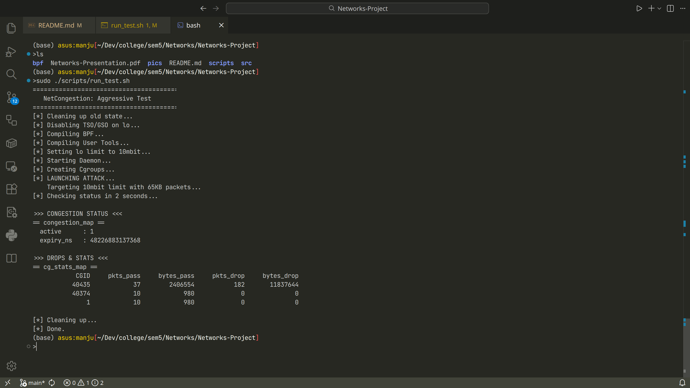

## How to Build and Test the project

Run the following command from the main directory of the project to build and test the project. 
This will require `sudo` permissions.

command:
`sudo ./scripts/run_test.sh`

After running the script. It will create two cgroup, one will aggressively floods traffic
while the other doesn't and after 2 seconds it will report number of packets of each
cgroup has dropped and you can observe that packets of the cgroup which was flooding 
the traffic have dropped.

<!--  -->

You can find other graphs and images of the project in the pics directory.